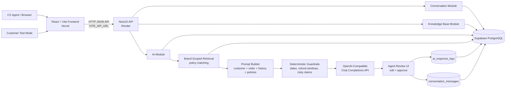
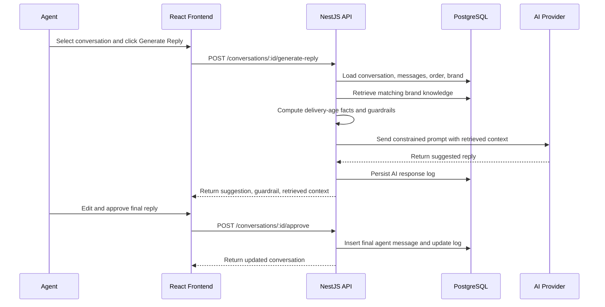

# CX Reply Assistant Architecture Diagram

```mermaid
flowchart LR
  Agent["CX Agent / Browser"] --> Web["React + Vite Frontend<br/>Vercel"]
  Customer["Customer Test Mode"] --> Web

  Web -->|"HTTP JSON API<br/>VITE_API_URL"| Api["NestJS API<br/>Render"]

  Api --> Conv["Conversation Module"]
  Api --> KB["Knowledge Base Module"]
  Api --> AI["AI Module"]

  Conv --> DB[("Supabase PostgreSQL")]
  KB --> DB
  AI --> DB

  AI --> Retrieval["Brand-Scoped Retrieval<br/>policy matching"]
  Retrieval --> DB
  Retrieval --> Prompt["Prompt Builder<br/>customer + order + history + policies"]
  Prompt --> Guardrails["Deterministic Guardrails<br/>dates, refund windows, risky claims"]
  Guardrails --> LLM["OpenAI-Compatible<br/>Chat Completions API"]
  LLM --> Review["Agent Review UI<br/>edit + approve"]
  Review --> Logs[("ai_response_logs")]
  Review --> Messages[("conversation_messages")]

  Logs --> DB
  Messages --> DB
```

## Data Flow

```mermaid
sequenceDiagram
  participant U as Agent
  participant W as React Frontend
  participant A as NestJS API
  participant D as PostgreSQL
  participant M as AI Provider

  U->>W: Select conversation and click Generate Reply
  W->>A: POST /conversations/:id/generate-reply
  A->>D: Load conversation, messages, order, brand
  A->>D: Retrieve matching brand knowledge
  A->>A: Compute delivery-age facts and guardrails
  A->>M: Send constrained prompt with retrieved context
  M-->>A: Return suggested reply
  A->>D: Persist AI response log
  A-->>W: Return suggestion, guardrail, retrieved context
  U->>W: Edit and approve final reply
  W->>A: POST /conversations/:id/approve
  A->>D: Insert final agent message and update log
  A-->>W: Return updated conversation
```

