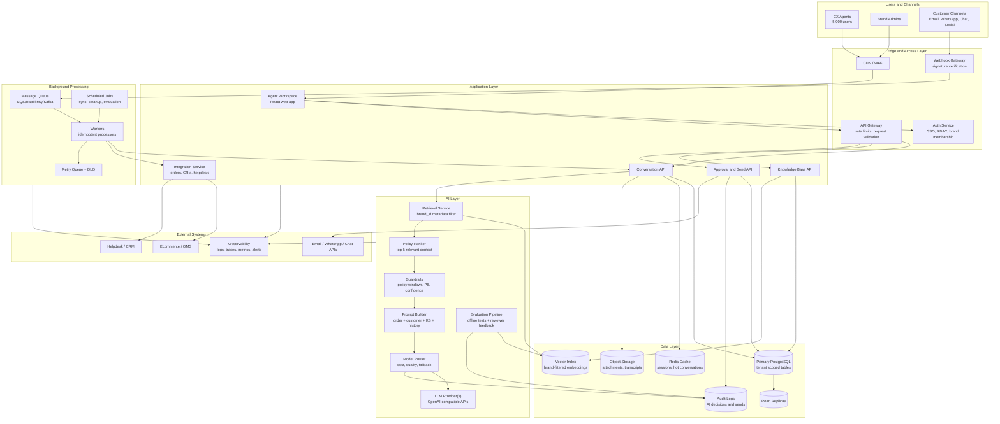

# Scaled CX Reply Assistant Architecture Diagram

Use this Mermaid code for the Part 2 system design diagram.

```mermaid
flowchart TB
  subgraph Users["Users and Channels"]
    Agent["CX Agents<br/>5,000 users"]
    Admin["Brand Admins"]
    Channels["Customer Channels<br/>Email, WhatsApp, Chat, Social"]
  end

  subgraph Edge["Edge and Access Layer"]
    CDN["CDN / WAF"]
    Auth["Auth Service<br/>SSO, RBAC, brand membership"]
    Webhook["Webhook Gateway<br/>signature verification"]
    API["API Gateway<br/>rate limits, request validation"]
  end

  subgraph App["Application Layer"]
    Frontend["Agent Workspace<br/>React web app"]
    ConversationAPI["Conversation API"]
    KnowledgeAPI["Knowledge Base API"]
    ApprovalAPI["Approval and Send API"]
    IntegrationAPI["Integration Service<br/>orders, CRM, helpdesk"]
  end

  subgraph Async["Background Processing"]
    Queue["Message Queue<br/>SQS/RabbitMQ/Kafka"]
    Workers["Workers<br/>idempotent processors"]
    RetryDLQ["Retry Queue + DLQ"]
    Scheduler["Scheduled Jobs<br/>sync, cleanup, evaluation"]
  end

  subgraph Data["Data Layer"]
    PrimaryDB[("Primary PostgreSQL<br/>tenant scoped tables")]
    ReadReplica[("Read Replicas")]
    Cache[("Redis Cache<br/>sessions, hot conversations")]
    ObjectStore[("Object Storage<br/>attachments, transcripts")]
    VectorDB[("Vector Index<br/>brand-filtered embeddings")]
    AuditDB[("Audit Logs<br/>AI decisions and sends")]
  end

  subgraph AI["AI Layer"]
    Retrieval["Retrieval Service<br/>brand_id metadata filter"]
    PolicyRanker["Policy Ranker<br/>top-k relevant context"]
    Guardrails["Guardrails<br/>policy windows, PII, confidence"]
    PromptBuilder["Prompt Builder<br/>order + customer + KB + history"]
    ModelRouter["Model Router<br/>cost, quality, fallback"]
    LLM["LLM Provider(s)<br/>OpenAI-compatible APIs"]
    Eval["Evaluation Pipeline<br/>offline tests + reviewer feedback"]
  end

  subgraph External["External Systems"]
    Ecommerce["Ecommerce / OMS"]
    Helpdesk["Helpdesk / CRM"]
    Notification["Email / WhatsApp / Chat APIs"]
    Monitoring["Observability<br/>logs, traces, metrics, alerts"]
  end

  Agent --> CDN --> Frontend
  Admin --> CDN
  Frontend --> Auth
  Frontend --> API

  Channels --> Webhook --> Queue
  API --> ConversationAPI
  API --> KnowledgeAPI
  API --> ApprovalAPI

  Queue --> Workers
  Workers --> ConversationAPI
  Workers --> IntegrationAPI
  Workers --> RetryDLQ
  Scheduler --> Workers

  ConversationAPI --> PrimaryDB
  ConversationAPI --> Cache
  ConversationAPI --> ObjectStore
  KnowledgeAPI --> PrimaryDB
  KnowledgeAPI --> VectorDB
  ApprovalAPI --> PrimaryDB
  ApprovalAPI --> AuditDB

  IntegrationAPI --> Ecommerce
  IntegrationAPI --> Helpdesk
  ApprovalAPI --> Notification

  ConversationAPI --> Retrieval
  Retrieval --> VectorDB
  Retrieval --> PolicyRanker
  PolicyRanker --> Guardrails
  Guardrails --> PromptBuilder
  PromptBuilder --> ModelRouter
  ModelRouter --> LLM
  ModelRouter --> AuditDB
  Eval --> VectorDB
  Eval --> AuditDB

  PrimaryDB --> ReadReplica
  App --> Monitoring
  Async --> Monitoring
  AI --> Monitoring
```

